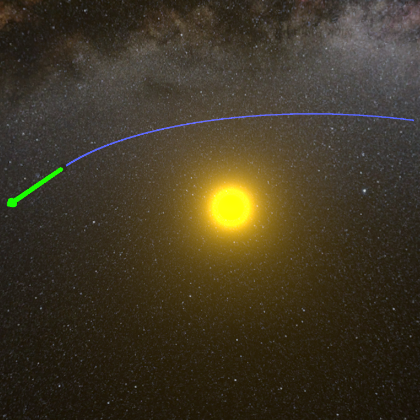
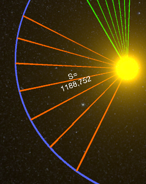
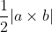
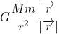
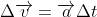
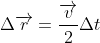

# Kepler-Counter
An application for demonstrating the equality of the areas of two sectors formed by a celestial body in a certain time.
 
 

 
## Area calculation 

 
When a discrete bypass of the trajectory occurs, the program remembers the points bypassed and calculates the areas of the corresponding triangular sectors using the formula:
 

 
## How it actually works
I'm using the following formula to calculate the mutual gravity at each iteration:

 
Then I add the corresponding acceleration multiplied by the iteration time to the speed:
 

 
The movement is calculated according to the following formula:
 

 
## Code
The corresponding scripts are in \Assets\Scripts

